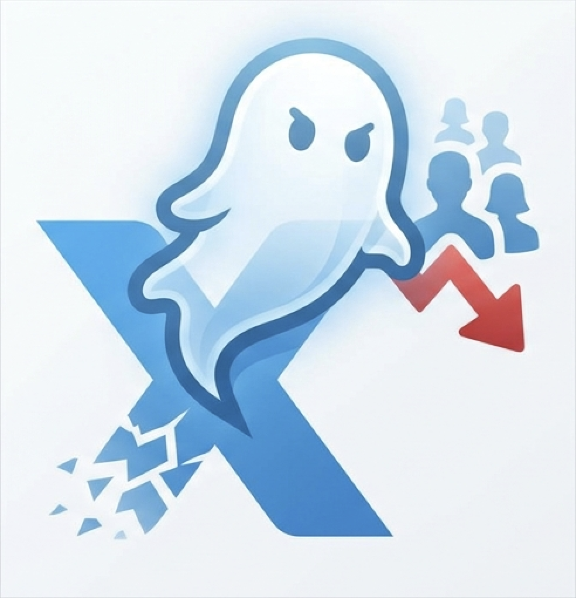

<div align="center">
  

  # XUnfollowGhost

  **Find out who unfollowed you on X (Twitter) — and spot the blue-verified ones.**

  
  
  
  

  <br/>

  > *"Someone unfollowed you? XUnfollowGhost knows who — even if they had the blue checkmark."*

</div>

---

## Features

- **Detect Unfollowers** — Automatically compares follower snapshots to find who left
- **Blue Verified Badge** — Highlights unfollowers who are X Premium (blue checkmark) subscribers
- **Auto Scan** — Configurable periodic scanning (1h / 3h / 6h / 12h / 24h)
- **Desktop Notifications** — Get alerted instantly when someone unfollows
- **Rich Dashboard** — Dark-themed UI matching X's design, with stats, avatars, and profile links
- **Scan History** — Full history of all scans with follower counts and changes
- **CSV Export** — Export your unfollower data for further analysis
- **No API Key Required** — Works with your existing X login session, zero configuration
- **Privacy First** — All data stored locally in your browser. Nothing is sent to any server.

## Screenshots

<div align="center">

| Dashboard | Unfollower List | Settings |
|:---------:|:---------------:|:--------:|
| Stats overview with follower count, unfollower count, and scan history | Unfollower cards with avatar, name, blue-V badge, and detection time | Auto-scan interval, notifications, CSV export, and data management |

</div>

## Quick Start

### Installation (Developer Mode)

1. **Download** this repository:
   ```bash
   git clone https://github.com/YourUsername/XUnfollowGhost.git
   ```

2. Open **Chrome** and navigate to:
   ```
   chrome://extensions
   ```

3. Enable **Developer mode** (toggle in the top right corner)

4. Click **"Load unpacked"** and select the `extension/` folder inside the project

5. The XUnfollowGhost icon will appear in your Chrome toolbar

### First Use

1. **Visit [x.com](https://x.com)** — The extension automatically captures your authentication
2. **Click the extension icon** in the toolbar to open the popup
3. **Click "Scan Now"** — Your first scan builds a baseline snapshot of your followers
4. **Wait for the next scan** (or click Scan Now again) — The extension will compare the new snapshot against the baseline and show who unfollowed you

> **Note:** The first scan only establishes a baseline. Unfollowers will be detected starting from the second scan.

## How It Works

```
┌─────────────────────────────────────────────────────┐
│                    Your Browser                      │
│                                                      │
│  ┌──────────┐    Auth Tokens    ┌─────────────────┐ │
│  │  x.com   │ ───────────────> │  Service Worker  │ │
│  │  (tab)   │   content script  │  (Background)    │ │
│  └──────────┘                   │                   │ │
│                                 │  1. Fetch all     │ │
│  ┌──────────┐   Stats & Data   │     followers     │ │
│  │  Popup   │ <──────────────> │  2. Save snapshot │ │
│  │  (UI)    │   messages        │  3. Diff with     │ │
│  └──────────┘                   │     previous      │ │
│                                 │  4. Find ghosts!  │ │
│                                 └────────┬──────────┘ │
│                                          │             │
│                                 ┌────────▼──────────┐ │
│                                 │    IndexedDB      │ │
│                                 │  (Local Storage)  │ │
│                                 └───────────────────┘ │
└─────────────────────────────────────────────────────┘
```

### The Snapshot Diff Algorithm

XUnfollowGhost uses a simple but effective approach:

1. **Snapshot** — Each scan fetches your complete follower list and saves it as a sorted array of user IDs
2. **Diff** — A two-pointer merge algorithm compares the previous and current snapshots in O(n+m) time
3. **Result** — IDs in the previous snapshot but not in the current one = **unfollowers**

### Authentication

The extension **does not require an X API key**. Instead, it:

1. Injects a lightweight script into X's page context
2. Captures the Bearer token and CSRF token from X's own outgoing requests
3. Uses these tokens (along with your browser cookies) to call X's internal GraphQL API
4. All authentication stays within your browser — nothing is sent externally

## Configuration

| Setting | Default | Description |
|---------|---------|-------------|
| Auto-scan | Enabled | Periodically check for unfollowers |
| Scan Interval | 6 hours | How often to scan (1h / 3h / 6h / 12h / 24h) |
| Notifications | Enabled | Desktop alerts when unfollowers are detected |

All settings are accessible via the gear icon in the popup.

## Tech Stack

| Component | Technology |
|-----------|------------|
| Extension Format | Chrome Manifest V3 |
| Background | Service Worker (ES Modules) |
| Storage | IndexedDB (snapshots & history) + chrome.storage (settings) |
| Scheduling | chrome.alarms API |
| UI | Vanilla HTML/CSS/JS, X dark theme |
| API | X's internal GraphQL (no official API key needed) |
| Build | None — zero dependencies, no bundler |

## Project Structure

```
XUnfollowGhost/
├── icon.png                              # Project logo
├── extension/                            # Chrome extension (load this folder)
│   ├── manifest.json                     # Extension manifest (MV3)
│   ├── assets/icons/                     # Extension icons (16/48/128px)
│   └── src/
│       ├── background/
│       │   └── service-worker.js         # Scan orchestration & scheduling
│       ├── content/
│       │   ├── content-script.js         # Auth bridge (isolated world)
│       │   └── page-interceptor.js       # Token extraction (page world)
│       ├── popup/
│       │   ├── popup.html                # Popup structure
│       │   ├── popup.css                 # X dark theme styles
│       │   └── popup.js                  # UI logic & rendering
│       └── lib/
│           ├── constants.js              # Configuration & defaults
│           ├── messages.js               # Message type definitions
│           ├── db.js                     # IndexedDB wrapper
│           ├── diff-engine.js            # Snapshot comparison
│           └── x-api.js                  # X GraphQL API client
└── README.md
```

## Rate Limiting & Safety

The extension is designed to be respectful of X's servers:

- **3-5 second delay** between each API request (with random jitter)
- **Exponential backoff** on rate limit responses (429), starting at 60 seconds
- **Auto-abort** after 5 consecutive rate limits to protect your account
- **Progress tracking** so you always know the scan status

## FAQ

<details>
<summary><b>Is this safe to use? Will my account get banned?</b></summary>

The extension uses the same internal API that X's own web app uses, with your existing session. It includes conservative rate limiting to avoid triggering X's abuse detection. While no third-party tool can guarantee 100% safety, XUnfollowGhost is designed to behave like a normal user browsing their followers page.
</details>

<details>
<summary><b>Why can't I see unfollowers after the first scan?</b></summary>

The first scan creates a baseline snapshot. The extension needs two snapshots to compare — unfollowers are detected starting from the second scan.
</details>

<details>
<summary><b>How long does a scan take?</b></summary>

It depends on your follower count. Each page returns ~20 followers with a 3-5 second delay between requests. Approximate times: 100 followers ≈ 30 seconds, 1K followers ≈ 5 minutes, 10K followers ≈ 30 minutes, 100K followers ≈ 5 hours.
</details>

<details>
<summary><b>Does this work with private/protected accounts?</b></summary>

It works for your own account regardless of privacy settings, since it uses your authenticated session.
</details>

<details>
<summary><b>Where is my data stored?</b></summary>

All data is stored locally in your browser using IndexedDB and chrome.storage. Nothing is sent to any external server. You can export your data as CSV or clear it entirely from the Settings panel.
</details>

<details>
<summary><b>What if X changes their internal API?</b></summary>

The extension dynamically captures API parameters from X's own requests. If X makes breaking changes, simply visit x.com to let the extension recapture the updated configuration. Fallback values are also built in.
</details>

## Contributing

Contributions are welcome! Feel free to submit issues and pull requests.

## Disclaimer

This project is for educational and personal use. It is not affiliated with, endorsed by, or associated with X Corp. Use it responsibly and at your own risk. The extension interacts with X's internal APIs which may change without notice.

## License

[MIT](LICENSE)

---

<div align="center">
  <sub>Built with curiosity. If this tool helped you, give it a star!</sub>
</div>
